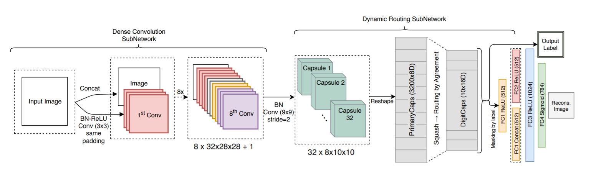
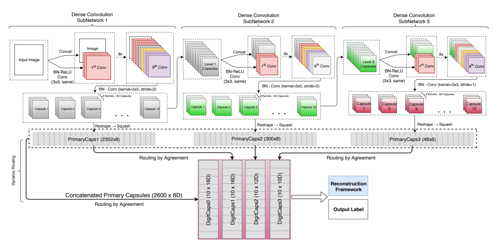
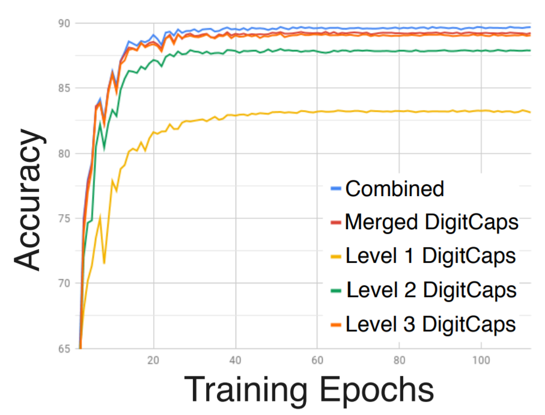
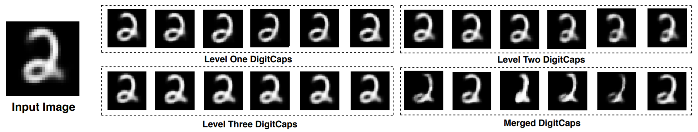

# Multi-level Dense Capsule Networks

This repository contains the code for Multi-level DCNets introduced in the following paper:

[Multi-level Dense Capsule Networks](https://drive.google.com/file/d/1s3tidLkoezWJOGxi8o4L4cLfEkoDy7Ak) (ACCV 2018)

[Sai Samarth R Phaye](ssrp.github.io)\*, [Apoorva Sikka](https://scholar.google.co.in/citations?user=_XL5F5kAAAAJ)\*, [Abhinav Dhall](https://sites.google.com/site/dhallabhinav/) and [Deepti R Bathula](http://www.iitrpr.ac.in/cse/bathula) (\* Authors contributed equally).

Please note: The [arXiv link to the paper](https://arxiv.org/pdf/1805.04001.pdf) contains an old version of the paper which was submitted to BMVC 2018. The new (ACCV) paper should be published soon by Springer.

### Citation
If you find Multi-level DCNets useful in your research, please consider citing:

	@inproceedings{phaye2018multi,
	  title={Multi-level Dense Capsule Networks},
	  author={Phaye, Sai Samarth R and Sikka, Apoorva and Dhall, Abhinav and Bathula, Deepti R },
	  booktitle={Proceedings of Asian Conference on Computer Vision},
	  year={2018}
	}
  
## Contents
1. [Introduction](#introduction)
2. [Usage](#usage)
3. [Results](#results)
4. [Other Implementations](#other-implementations)
5. [Contact Us](#contact-us)

## Introduction
We improve the capsule networks and highlight its potential on various datasets. We introduce two methods that act as the building blocks for the Multi-level DCNets. First is Multi-level CapsNet which aims to learn hierarchical features by creating multiple level of capsules. Another is DCNet, which replaces standard convolution layers in CapsNet with densely connected convolutions. Addition of direct connections between two consecutive layers helps to learn better feature maps, in turn forming better quality primary capsules. The effectiveness of DCNets is demonstrated by state-of-the-art performance (99.75%) on MNIST data with twenty-fold decrease in total training iterations, over conventional CapsNets. Following is the architecture of DCNet:
<p align="center">

</p>
Multi-level DCNets imports the multi-level capsules and DenseNets in CapsNets to enhance the representational power of the network. The hierarchical structure helps learn intricate relationships between fine-to-coarse level features. A single 3-level DCNet (13.4M parameters) achieves 89.71% accuracy on CIFAR-10, which is an increase of +0.31% accuracy over seven ensemble CapsNet model (101.5M parameters) with significantly less number of parameters. Following is the architecture of a 3-level DCNet: 
<p align="center">

</p>

## Usage

The repository contains codes for traning a DCNet on MNIST dataset (dcnet.py) and a 3-level DCNet on CIFAR-10 dataset (3leveldcnet.py). Following is the procedure:

**Step 1.
Install [Keras>=2.0.7](https://github.com/fchollet/keras)
with [TensorFlow>=1.2](https://github.com/tensorflow/tensorflow) backend.**
```
pip install tensorflow-gpu
pip install keras
```

**Step 2. Clone the repository to local.**
```
git clone https://github.com/ssrp/Multi-level-DCNet.git Multi-level-DCNet
cd Multi-level-DCNet
```


**Step 4. Train the network**  

Training DCNet on MNIST with default settings:
```
python dcnet.py
```

Training 3-level DCNet on CIFAR-10 with default settings:
```
python 3leveldcnet.py
```
For more settings, the code is well-commented and it's easy to change the parameters looking at the comments. 

## Results

We perform various ablation experiments to prove the efficacy of Multi-level DCNets, including MultiMNIST segmentation test and test to check robustness to affine transformations (using Affnist dataset). All the results could be found in the ACCV paper. Following figure depicts separate accuracy curves for different DigitCaps of 3-level DCNet on CIFAR-10:
<p align="center">

</p>
It can be seen that Level-3 and Merge-DigitCaps layer play a major role in the final performance. We also explore the relative effect of different levels of DigitCaps on the reconstruction outputs and experiment on the MNIST dataset by subtracting 0.2 from each digit one at a time in the 54D DigitCaps. It is observed (shown in the Figure below) that the effect on reconstructions decrease from the first level to the last level of capsules. This could be due to the fact that the first level DigitCaps activates very small area of an image and when perturbations are added to such smaller levels, it leads to an increased overall change in image (and vice versa). Also, it is observed that DigitCaps obtained from the concatenation of PrimaryCaps was most sensitive to this noise.
<p align="center">

</p>

## Other Implementations

If you are writing code for Multi-level DCNets in any other framework, please let us know and we'll be happy to share the link here.

## Contact Us
We welcome any discussions, suggestions and questions: 

2014csb1029@iitrpr.ac.in, phaye.samarth@gmail.com (Sai Samarth R Phaye)

apoorva.sikka@iitrpr.ac.in (Apoorva Sikka)
